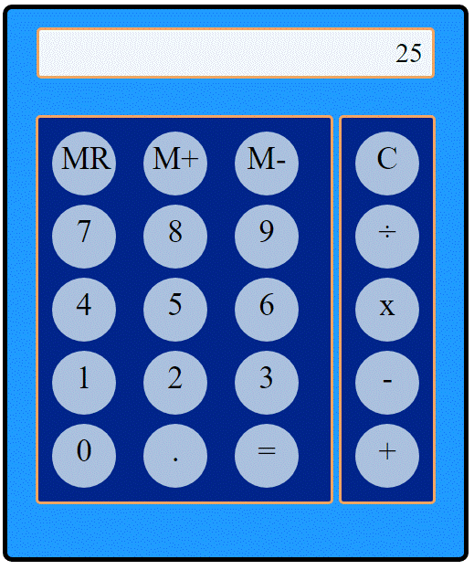

## Rock Paper Scissor Game

Calculator made with basic HTML, CSS and JavaScript

Try it out [here](https://fritzchips.github.io/Calculator/)

## Instructions

- Input the numbers of choice up to 10 characters.
- Choose the operator that you want to run on the right section.
- `C` button to clear
- `MR` use a saved input from memory
- `M+` save one input to memory
- `M-` remove save input from memory

## Summary

I wanted to create this project to expand my knowledge of operators and event listeners. When the user inputs a value, it is looped through the `DOM` , saved as a value and displayed on the screen. The operators process the request through a `switch` and the total return value is displayed. This project has taught me to be efficient with the use of `forEach` loop.

## Author

---

- **Fritz Solibio** - _Software Development Mastermind Student_
